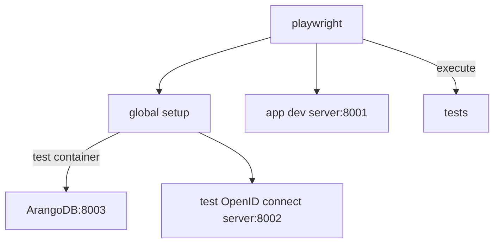

<!--
SPDX-FileCopyrightText: LXCat team

SPDX-License-Identifier: AGPL-3.0-or-later
-->

# LXCat web application and web service

[](https://codecov.io/gh/LXCat-project/LXCat?flags[0]=app)

- [LXCat web application and web service](#lxcat-web-application-and-web-service)
  - [Getting Started](#getting-started)
  - [Learn More](#learn-more)
  - [Setup auth](#setup-auth)
    - [In auth0 dashboard](#in-auth0-dashboard)
    - [In GitLab application settings](#in-gitlab-application-settings)
    - [For Orcid sandbox](#for-orcid-sandbox)
    - [For Orcid](#for-orcid)
    - [For Keycloak](#for-keycloak)
    - [In local directory](#in-local-directory)
  - [End to end tests](#end-to-end-tests)
  - [Unit Tests](#unit-tests)
  - [Optimizations](#optimizations)

This is a [Next.js](https://nextjs.org/) project bootstrapped with
[`create-next-app`](https://github.com/vercel/next.js/tree/canary/packages/create-next-app).

## Getting Started

First, run the development server:

```bash
cd .. # in root of repo
bun install
bun dev  # Starts app, database, schema workspaces in development mode
```

The application uses the `@lxcat/database` package, which needs an ArangoDB
database server, see its [README](../packages/database/README.md) for how to
setup the database.

Open [http://localhost:3000](http://localhost:3000) with your browser to visit
the development environment.

You can start editing the page by modifying `src/pages/index.tsx`. The page
auto-updates as you edit the file.

The `src/pages/api` directory is mapped to `/api/*`. Files in this directory are
treated as [API routes](https://nextjs.org/docs/api-routes/introduction) instead
of React pages. However, this app uses the
[app router](https://nextjs.org/docs/app/building-your-application/routing/route-handlers)
instead of the pages router to implement API routes, so the files can be found
at `/app/api/**/route.ts`.

## Learn More

To learn more about Next.js, take a look at the following resources:

- [Next.js Documentation](https://nextjs.org/docs) - learn about Next.js
  features and API.
- [Learn Next.js](https://nextjs.org/learn) - an interactive Next.js tutorial.

You can check out
[the Next.js GitHub repository](https://github.com/vercel/next.js/) - your
feedback and contributions are welcome!

## Setup auth

The app can use [Orcid](https://orcid.org), [Auth0](https://auth0.com/),
[Keycloak](http://www.keycloak.org/) or
[GitLab Appliction](https://gitlab.com/-/profile/applications) to perform
authentication. User management is stored in the ArangoDB `users` collection.

### In auth0 dashboard

1. Create a new application of type `Regular Web Applications`.

   - Allowed Callback URLs
     - For dev deployment set to `http://localhost:3000/api/auth/callback/auth0`
   - Allowed Logout URLs
     - For dev deployment set to `http://localhost:3000`

2. Make sure `disable sign ups` is disabled in auth0 authentication database
   settings. So users can register themselves.

### In GitLab application settings

1. Create a [new application](https://gitlab.com/-/profile/applications)

   - Redirect URI
     - For dev deployments set to
       `http://localhost:3000/api/auth/callback/gitlab`
   - Scopes
     - Select `read_user`, `openid`, `profile` and `email`

### For Orcid sandbox

1. Register on [https://sandbox.orcid.org/](https://sandbox.orcid.org/)

   - Only one app can be registered per orcid account, so use alias when primary
     account already has an registered app.
   - Use `<something>@mailinator.com` as email, because to register app you need
     a verified email and Orcid sandbox only sends mails to `mailinator.com`.

2. Goto
   [https://www.mailinator.com/v4/public/inboxes.jsp](https://www.mailinator.com/v4/public/inboxes.jsp)
   and search for `<something>` and verify your email adress
3. Goto [https://sandbox.orcid.org/account](https://sandbox.orcid.org/account),
   make email public for everyone
4. Goto
   [https://sandbox.orcid.org/developer-tools](https://sandbox.orcid.org/developer-tools)
   to register for public API.

   - Your website URL
     - Does not allow localhost URL, so use `https://lxcat.net`
   - Redirect URI
     - For dev deployments set to
       `http://localhost:3000/api/auth/callback/orcidsandbox`

### For Orcid

1. Register on [https://orcid.org/](https://orcid.org/)

   - Only one app can be registered per orcid account, so use alias when primary
     account already has an registered app.

2. Goto [https://orcid.org/developer-tools](https://orcid.org/developer-tools)
   to register for public API.

   - Your website URL
     - Does not allow localhost URL, so use `https://lxcat.net`
   - Redirect URI, requires https
     - For dev deployments the nextjs server on <http://localhost:3000> has to
       be reversed-proxied to https This can be done with
       [caddyserver](https://caddyserver.com/)

       ```sh
       caddy run
       # This will ask for sudo login to install a CA certificate into local trust store so browser trusts the URL
       ```

       This will make app available on
       [https://localhost:8443](https://localhost:8443). In Orcid site set the
       redirect URL to `https://localhost:8443/api/auth/callback/orcid`. Also
       set `NEXT_PUBLIC_URL=https://localhost:8443` in `.env.local` file.
     - For production deployments set to
       `https://< lxcat domain >/api/auth/callback/orcid` Also set
       `NEXT_PUBLIC_URL=https://< lxcat domain >` in `.env.local` file.

### For Keycloak

[Keycloak](http://www.keycloak.org/) is an open source oauth provider which can
be used for local accounts in production.

<details>
<summary>How to configure keycloak</summary>

First spinup a container with

```shell
docker run --rm  -p 8080:8080 -e KEYCLOAK_ADMIN=admin -e KEYCLOAK_ADMIN_PASSWORD=admin quay.io/keycloak/keycloak:18.0.2 start-dev
```

Goto http://localhost:8080/admin/master/console and login with admin:admin.

1. [Create realm](http://localhost:8080/admin/master/console/#/create/realm)
   called `lxcat-test-realm`
2. [Create users](http://localhost:8080/admin/master/console/#/realms/lxcat-test-realm/users)
   - The password must be set in Credentials tab, dont forget to turn off
     `temporary` field.
   - Set `orcid` and `picture` in Attributes tab to `0000-0001-2345-6789` and
     `/lxcat.png` respectively.
3. [Create client](http://localhost:8080/admin/master/console/#/create/client/lxcat-test-realm).
   This is the oauth provider the lxcat app will authenticate against.
   - Client ID: lxcat-test
   - Client protocol: openid-connect
   - Root URL: http://localhost:3000 or whatever url the application is running
     on.
   - After creation edit client some more
   - Access type: confidential
   - To Valid Redirect URIs field add `https://localhost:3000/*`
   - Save it
   - On Mappers tab create mapper to expose orcid and picture user attributes
     - orcid mapper
       - Name: orcid
       - Mapper type: User Attribute
       - User attribute: orcid
       - Token Claim Name: orcid
       - Claim JSON Type: string
       - Save it
     - picture mapper
       - Name: picture
       - Mapper type: User Attribute
       - User attribute: picture
       - Token Claim Name: picture
       - Claim JSON Type: string
   - On creditials tab copy Secret value to KEYCLOAK_CLIENT_SECRET in
     /app/e2e/.env.test file.

</details>

### In local directory

In the root `.env.development` file (or `.env.production` depending on the
desired environment) define the following key/value pairs

```env
# Used as root url for absolute URLs.
NEXT_PUBLIC_URL=<URL where users visit server, like http://localhost:3000>

# Where openid identity provider should redirect back to.
NEXTAUTH_URL=<URL where users visit server, like http://localhost:3000>
# Secret used to sign JWT api tokens.
NEXTAUTH_SECRET=<Random string>

# Optional: URL of the ArangoDB api; usually left as default: http://localhost:8529.
ARANGO_URL=<URL>
# Optional: Name of the database that hosts LXCat related data. Default: `lxcat`.
ARANGO_DB=<Database name>
# Optional: Name of the restricted ArangoDB user used by `app` to communicate to the database. Default: `lxcat`.
ARANGO_USERNAME=<Username>
# Password used by the `ARANGO_USERNAME` user to connect to database
ARANGO_PASSWORD=<ArangoDB `app` user password>
# ArangoDB root password.
ARANGO_ROOT_PASSWORD=<Arangodb root password>

# When you want to use Auth0 as identity provider set the AUTH0_* vars
AUTH0_CLIENT_ID=<Client ID from Auth0 application settings page>
AUTH0_CLIENT_SECRET=<Client secret from Auth0 application settings page>
AUTH0_ISSUER=<Domain from Auth0 application settings page with `https://` prepended>

# When you want to use GitLab as identity provider set the GITLAB_* vars
GITLAB_CLIENT_ID=<Application ID from GitLab application page>
GITLAB_CLIENT_SECRET=<Client secret from GitLab application page>

# When you want to use Orcid as identity provider set the ORCID_* vars
ORCID_CLIENT_ID=<Client ID from Orcid developer tools page>
ORCID_CLIENT_SECRET=<Client secret from Orcid developer tools page>
# To use Orcid sandbox instead of production Orcid set following var
ORCID_SANDBOX=True

# When you want to use Keycloak as identity provider set the KEYCLOAK_* vars
KEYCLOAK_CLIENT_ID=<Client ID from Keycloak client page>
KEYCLOAK_CLIENT_SECRET=<Client secret from credentials tab on the Keycloak client page>
KEYCLOAK_ISSUER=<Keycloak base url and realm. eg. http://localhost:8080/realms/master>
```

At least one identity provider should be configured.

## End to end tests

The end to end tests (`e2e/**.spec.ts`) are written and run using
[playwright](https://playwright.dev/).

Before running test ensure playwright's chromium browser is installed with

```shell
npx playwright install chromium
```

Also make sure port 8001, 8002, and 8003 are not in use.

```shell
bun test:e2e
```

To debug and record add `await page.pause()` and run tests with

```shell
bun test:e2e -- --headed
```

The test command spins up the app dev server, ArangoDB in a Docker container, a
test OpenID connect server and then executes the tests in the `e2e/` directory.



The `e2e/global-setup.ts` file is used as playwrights global setup to spinup the
ArangoDB and test identity provider. It also

- signs up admin user, to become admin user in tests add
  `test.use({ storageState: "adminStorageState.json" });`,
- has utility functions to fill and truncate database collections.

The `e2e/test-oidc-server.ts` file contains an OpenID connect server which
accepts any email/password combination and returns a dummy profile with orcid
and picture. The application configures its client by using the
`TESTOIDC_CLIENT_*` env vars.

## Unit Tests

See [code contributor doc](../docs/code-contributor#unit-tests)

## Optimizations

To see which modules are loaded by web browser use

```shell
ANALYZE=true bun run build
```

The result is written to `.next/analyze/client.html`.

## API Development

All API routes are built with zod schemas that can be used to verify query, path
or body parameters by using the `zodMiddleware` function in your `RouteBuilder`
chain. Each endpoint also has a corresponding `openapi.ts` file which is used to
generate an OpenAPI endpoint description.

When the `/api/doc` endpoint is first queried, all `register` methods in every
`openapi.ts` file under `src/app/api/` will get called. This function should use
the global OpenAPI `registry()` to register the defined behaviour of the
endpoint using the `zod-to-openapi` function `registerPath()`.

When using existing schemas in input or output schemas, add the schema to the
`register()` function in `app/api/schemas.openapi.ts`, manually adding the
required openapi metadata like shown in the already existing entries. Doing this
will prevent the schema from being duplicated in the OpenAPI spec when used more
than once, as it will be placed under the `components/` path and referenced
where used.
