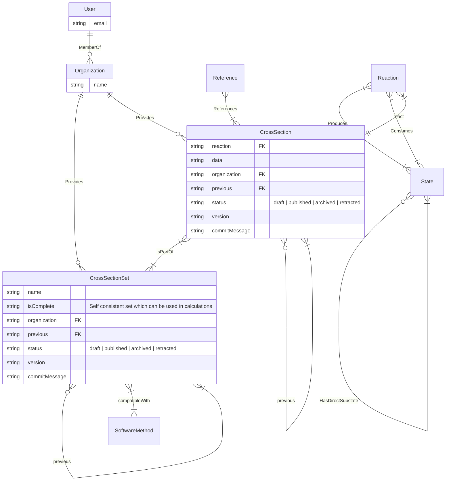

# Schema

```mermaid
erDiagram
    User {
        string email
    }
    Organization {
        string name
    }
    CrossSectionSet {
        string name
        string isComplete "Self consistent set which can be used in calculations"
        string organization FK
        string previous FK ""
        string status "draft | published | archived | retracted"
        string version
        string commitMessage  
    }
    CrossSection {
        string reaction FK
        string data
        string organization FK
        string previous FK ""
        string status "draft | published | archived | retracted"
        string version
        string commitMessage
    }
    User ||--o{ Organization: MemberOf
    Organization ||--o{ CrossSectionSet: Provides
    CrossSectionSet }o--|{ CrossSectionSet: previous
    CrossSection }|--|{ CrossSectionSet: IsPartOf
    Organization ||--o{ CrossSection: Provides
    CrossSection }o--|{ CrossSection: previous
    Reference }|--|{ CrossSection: References
    Reaction }|--|{ State: Produces
    Reaction }|--|{ State: Consumes
    State }o--|{ State: HasDirectSubstate
    Reaction }|--|| CrossSection: react
    CrossSectionSet }|--|{ SoftwareMethod: compatibleWith
```

Can be edited on https://mermaid.live/
