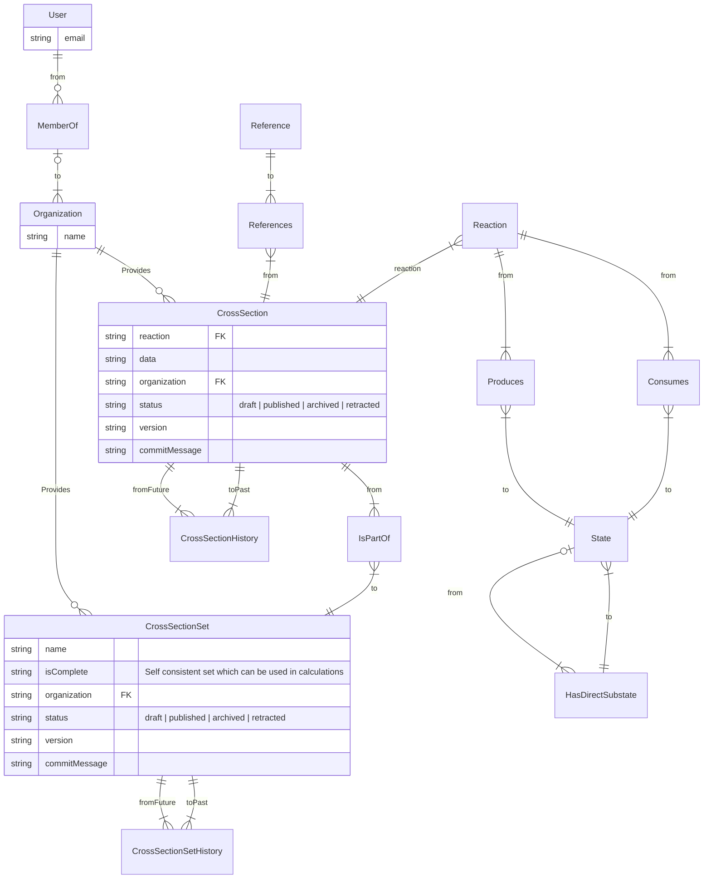

<!--
SPDX-FileCopyrightText: LXCat team

SPDX-License-Identifier: AGPL-3.0-or-later
-->

# Code contributor docs

This document is for someone developing the LXCat web application and its
packages.

- [Code contributor docs](#code-contributor-docs)
  - [Where is the code?](#where-is-the-code)
  - [How to perform local deployment with test data?](#how-to-perform-local-deployment-with-test-data)
  - [How to make a pull request](#how-to-make-a-pull-request)
  - [Documentation](#documentation)
    - [Code highlighting](#code-highlighting)
    - [Local images](#local-images)
    - [Diagrams](#diagrams)
    - [Math](#math)
  - [Technology wishes](#technology-wishes)
    - [Full stack web framework](#full-stack-web-framework)
    - [Schema / validation](#schema--validation)
  - [Technology choices](#technology-choices)
  - [Debugging](#debugging)
  - [Database diagram](#database-diagram)
  - [React component development](#react-component-development)
  - [Unit Tests](#unit-tests)
  - [Licensing](#licensing)
  - [Publishing software](#publishing-software)

## Where is the code?

Code is hosted on
[https://github.com/LXCat-project/lxcat](https://github.com/LXCat-project/lxcat).
Code to fill the database can be found in `/packages/database`. Code that runs
the website can be found in `/app`. Code that describes the shape of LXCat
documents can be found in `/packages/schema`. Code that can convert LXCat
documents to txt format can be found in `/packages/converter`.

## How to perform local deployment with test data?

See [/packages/database](packages/database/README.md) how to seed the database
with test data.

## How to make a pull request

See
[the GitHub documentation on pull requests](https://docs.github.com/en/pull-requests/collaborating-with-pull-requests/proposing-changes-to-your-work-with-pull-requests/creating-a-pull-request)
how to create a pull request in
[repository](https://github.com/LXCat-project/lxcat).

## Documentation

The documentation is formatted in
[GitHub flavored Markdown](https://docs.github.com/en/get-started/writing-on-github/getting-started-with-writing-and-formatting-on-github/basic-writing-and-formatting-syntax)
files in the `/docs` directory.

The documentation is also hosted on the website at
`https://<domain of lxcat website>/docs`.

To have working links between Markdown files on the website use URLs without the
`.md` extension.

The following features are available in Markdown

### Code highlighting

Code block will be highlighted. For example

````markdown
```ts
function add(a: string, b: string): string {
  return a + b;
}
```
````

is highlighted as

```ts
function add(a: string, b: string): string {
  return a + b;
}
```

### Local images

For example show the `./screenshot.png` image inside Markdown file use
``. The path of the image should be relative to the Markdown
file..

### Diagrams

You can add code blocks using
[mermaidjs](https://mermaid-js.github.io/mermaid/#/) format to render diagrams.

For example

````markdown

````

is rendered as


### Math

LaTeX equations can be added by wrapping the equation with `$$`.

For example

```markdown
$$ L = \frac{1}{2} \rho v^2 S C_L $$
```

is rendered as

$$ L = \frac{1}{2} \rho v^2 S C_L $$

<!--
Latex rendering with $$ delimiter is not yet available on GitLab,
see https://docs.gitlab.com/ee/user/markdown.html#latex-compatible-fencing
-->

## Technology wishes

Wishes for the pieces of software to be used.

Stack should be stable and usable by maintainers of lxcat.

The current lxcat is written in PHP and uses Mysql as database with phpmyadmin
as admin interface. In the new lxcat, the admin interface should be part of the
web application and offer some one to upload or edit a cross section set using a
web form. This new interface should be behind a login.

The prototype by Daan Boer is written in
[Typescript](https://www.typescriptlang.org/) and uses
[Arangodb](https://www.arangodb.com) as database. For the new lxcat we want to
keep using TypeScript and ArangoDB.

The current lxcat uses a
[time machine](https://nl.lxcat.net/data/time_machine.php) to show previous
versions of data. The current lxcat can show the whole lxcat website as it was
at a date in the past. This time machine is mainly there to have a reference in
a paper to a certain version of data. The new lxcat must also allow for showing
previous versions of data for proper referencing aswell. Instead of a time
machine implementation, we want to have multiple versions for each cross section
or each cross. Similar to [Zenodo](https://help.zenodo.org/#versioning) or
[Uniprot](https://www.uniprot.org/uniprot/Q9Y5N1?version=*)

### Full stack web framework

Whishes:

- renders most HTML on server
- reuse layout
- styled using ui framework like material or antd
- external authentication
- api with openapi
- markdown
- db agnostic

### Schema / validation

- Autocomplete for developer IDE -> Typescript
- Validate at boundaries like incoming request
- Validate during
  [inserting/updating into database](https://www.arangodb.com/docs/3.9/data-modeling-documents-schema-validation.html)
  with JSON schema
- Support complex schemas like cross section document
- Cross language: Should be able to generate or use JSON schemas
- Schema should be rich
  - title and description
  - min/max/length/etc. validation rules

Possible options see
https://learning-notes.mistermicheels.com/javascript/typescript/runtime-type-checking

## Technology choices

- Database = [ArangoDB](https://www.arangodb.com/)
- Programming language = [TypeScript](https://www.typescriptlang.org/)
- Web framework = [NextJS](https://nextjs.org/)
- UI framework = [React](https://reactjs.org/)
- UI style framework = [Mantine](https://mantine.dev/)
- API framework = API pages in NextJS
- App authentication = OpenID identity providers +
  [next-auth](https://next-auth.js.org)
- API authentication = (OpenID identity providers + next-auth) or JWT based API
  token
- Authorization = roles assigned to users
- OpenID identity provider = [Orcid](https://orcid.org/) or
  [Keycloak](https://www.keycloak.org/)
- Schema = [Zod](https://github.com/colinhacks/zod), used for validation,
  typescript type, JSON schema for API consumers and database collection
- Database seeding and migration = Handrolled directory importer
- Configuration = [dotenv](https://github.com/motdotla/dotenv)
- Production deployment = [docker-compose](https://github.com/docker/compose)
- Development deployment = Database in Docker container and app on bare-metal

## Debugging

In Visual Studio Code you can debug the server, client or fullstack by using the
`/.vscode/launcher.json` file. See
[NextJS debugging docs](https://nextjs.org/docs/advanced-features/debugging#debugging-with-vs-code)
and [VS Code docs](https://code.visualstudio.com/docs/nodejs/nodejs-debugging)
for more info.

## Database diagram

The following diagram shows all document and edge collections.

> The columns mentioned are for illustration. Each document collection has a
> JSON schema (defined in /packages/database/src/\*\*/schema.ts) which defines
> the shape of each document inserted/updated.



The diagram can be edited on https://mermaid.live/ by copying the code block
text.

<!--
## React component development

The React components can be developed in isolation with
[storybook](https://storybook.js.org/).

By writing a story as `/app/src/<Component>.stories.tsx` according to
[docs](https://storybook.js.org/docs/react/writing-stories/introduction).

The storybook can be run with

```shell
cd app
pnpm storybook
```

This will open a web browser where stories of components can be seen.

The storybook is build on Gitlab CI and can be found in the `test-app` CI job and browsing
the job artifacts to `/app/storybook-static/index.html`. This can be useful for other
people to test your component without having to install anything.
-->

## Unit Tests

Tests can be written as `src/**/*.{test,spec}.ts` files with
[vitest](https://vitest.dev/) framework and run with

```shell
pnpm test
```

To run tests with code coverage use

```shell
pnpm test -- run --coverage
xdg-open coverage/index.html
```

To debug tests in VS code

1. Place a breakpoint or `debugger` statement in code
2. In Debug sidebar select `Debug Current Test File`
3. Focus on test file
4. Press F5

## Licensing

This project uses GNU Affero General Public License v3.0 or later for the web
application and any package not published to npmjs.com. The Apache 2.0 license
is used for packages published to npmjs.com.

This project uses the [REUSE software](https://reuse.software/) recommendations
for licensing and copyright.

To test compliance use

```shell
python3 -m venv .venv
. .venv/bin/activate
pip install reuse
reuse lint
```

To add headers to files run `pnpm annotate` or if that fails add header
manually.

For binary files or text files without comment support a
`<original file name>.license` file can be made, alternativly add file in
`/.reuse/dep5` file.

## Publishing software

If there are changes to the code you want to cite you will need to create a new
Digital Object Identifier (DOI).

To create a new DOI:

1. Bump package versions in package.json files, rerun `pnpm install`, commit &
   push to main branch.
2. Create a new
   [GitHub release](https://github.com/LXCat-project/LXCat/releases/new).
3. On Zenodo page for LXCat, a new version needs to be created with the tarball
   of the new release.
