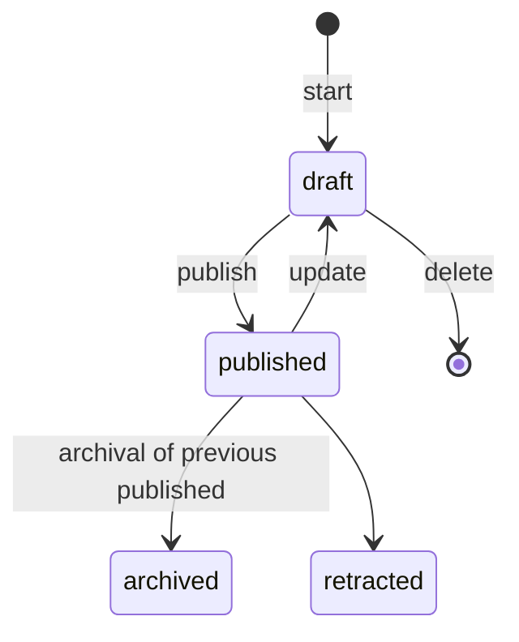

# Data contributor docs

## Submit

To submit a new scattering cross section

1. You need to login with your Orcid account.
2. On your profile page (for [development deployment](https://localhost/profile)) click `Add new scattering cross section`.
3. Fill the form or upload a file according to the JSON schema
4. The cross section is now viewable by you alone
5. Wait for editor to publish the cross section to the public

## Versioning

To keep track of changes over time the application uses versioning.
A cross section and a cross section set can have different versions in different statuses.

A cross section version or cross section set version can be in any of the statuses depicted above.
A draft, published, archived version of a cross section are connected using a graph to make a history table of the cross section like

| ID   | Version | Status    | Comment    | Created on |
| ---- | ------- | --------- | ---------- | ---------- |
| 1111 | 1       | archived  | Initial    | 1 Jan 2022 |
| 2222 | 2       | archived  | 1st update | 2 Jan 2022 |
| 3333 | 3       | published | 2nd update | 3 Jan 2022 |
| 4444 | 4       | draft     | 3rd update | 4 Jan 2022 |

A cross section set consists of one or more cross sections. A published cross section set can only have published cross sections. A draft cross section can have draft or published cross sections.
Two cross section sets can share cross sections.
