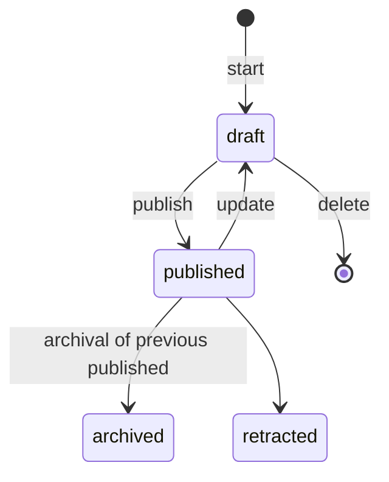

<!--
SPDX-FileCopyrightText: LXCat team

SPDX-License-Identifier: AGPL-3.0-or-later
-->

# Data contributor docs

This document is for someone adding or editing data.

- [Data contributor docs](#data-contributor-docs)
  - [Preparation](#preparation)
  - [Submit](#submit)
  - [Edit](#edit)
  - [Retract](#retract)
  - [Versioning](#versioning)
  - [Organization](#organization)

## Preparation

To perform data contribution tasks you first need to

1. Sign in
   - By clicking on `Sign in` button in the upper right corner of any page.
2. On your [profile](/profile) page click the `Perform author tasks` link.
   - If this link is missing then email
     [info@lxcat.net](mailto:info@lxcat.net?subject=LXCat%20contributor%20request) to
     request permission to contribute to LXCat. Please send the mail from the same email
     you used to sign into LXCat.

## Submit

To submit a new scattering cross section set:

1. Follow the `Scattering cross section set` link and then either
   - Click the `Add` button to fill the form
   - Or click `Add JSON document` to upload a file according to the
     [JSON schema](/api/scat-css/CrossSectionSetRaw.schema.json)
2. After the form is submitted or the upload is completed, the cross section set is in
   draft state and it is only viewable/editable by you and your organization colleagues.
3. To make the cross section set available to everyone
   - Press the `publish` button on
     [Author scattering cross section sets](/author/scat-css) page

## Edit

To edit an existing cross section set:

1. Follow the `Scattering cross section set` link and then either
   - Click the `Edit` button to edit using a form
   - Or click `Edit JSON` to edit the raw JSON document.
2. After the form is submitted the cross section set is in draft state and it is only
   viewable/editable by you and your organization colleagues
   - If you edited a published set a new draft version will be made and the published
     version of the set is unchanged.
   - If you edited a draft set the changes will be made in-place, and no new version is
     made.
3. To make the cross section set available to everyone
   - Press the `publish` button on
     [Author scattering cross section sets](/author/scat-css) page
   - If the draft version had a published version then the draft becomes the new published
     version and the previously published version becomes archived.

## Retract

If there is a grave error in a cross section set you might want to retract the set, such
that it is clear to visitors of the website that the set should not be used anymore.

> Be careful! Once a cross section set is retracted it can not be undone.

To retract a cross section set:

1. Follow the `Scattering cross section set` link and then click the `Retract` button
2. Fill the form describing why this set should be retracted.
3. Press the `retract` button.
4. The cross section set is now no longer visible on the search page. It is still possible
   to visit the details page via a direct link, but it will show a retraction message.

## Versioning

To keep track of changes over time the application uses versioning. A cross section and a
cross section set can have different versions in different statuses.

- **draft**: Only visible by organization members in author pages after authentication.
- **published**: Visible on the search page.
- **archived**: Not visible on the search page. Details page renders with warning that
  there is a newer version.
- **retracted**: Not visible on search page. Details pages renders with warning that it
  should not be used.

A cross section version or cross section set version can be in any of the statuses
depicted above.

The draft, published, and archived versions of a cross section are connected and tracked
in the database. Conceptually, the history of a cross section looks as follows:

| ID   | Version | Status    | Comment    | Created on |
| ---- | ------- | --------- | ---------- | ---------- |
| 1111 | 1       | archived  | Initial    | 1 Jan 2022 |
| 2222 | 2       | archived  | 1st update | 2 Jan 2022 |
| 3333 | 3       | published | 2nd update | 3 Jan 2022 |
| 4444 | 4       | draft     | 3rd update | 4 Jan 2022 |

The history table of a cross section or cross section set can be inspected by appending
`/history` to their details page URL. Naturally, each cross section set contains at least
one cross section. A similar history is recorded for each of the constituent cross
sections. Note that a published cross section set can only contain published cross
sections, but a draft set is allowed to contain draft cross section.

## Organization

An organization has users as members. A cross section set is owned by an organization.

Any member of an organization can edit the cross section sets owned by that organization.
A single cross section can be present in multiple cross section sets, but those sets must
be owned by same organization.

To become member of an organization in LXCat you can email
[info@lxcat.net](mailto:info@lxcat.net?subject=LXCat%20organization%20request) to request
access.

<!-- TODO: Is this true? -->

A cross section is always part of a cross section set.
