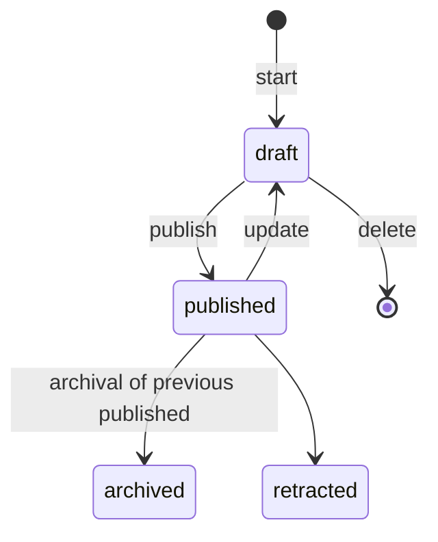

<!--
SPDX-FileCopyrightText: LXCat team

SPDX-License-Identifier: AGPL-3.0-or-later
-->

# Data contributor docs

This document is for someone adding or editing data.

- [Data contributor docs](#data-contributor-docs)
  - [Preparation](#preparation)
  - [Submit](#submit)
  - [Edit](#edit)
  - [Retract](#retract)
  - [Versioning](#versioning)

## Preparation

To perform data contribution tasks you first need to

1. Sign in 
   - By clicking on `Sign in` button in upper right corner of any page.
2. On your [profile](/profile) page click `Perform author tasks` link. 
   - If this link is missing then email [info@lxcat.net](mailto:info@lxcat.net?subject=LXCat%20contributor%20request&body=Hi%20LXCat%20administrator%2C%0AI%20would%20like%20permission%20to%20contribute%20data.) to request permission to contribute to LXCat. Please send the mail from the same email you used to sign into LXCat.

## Submit

To submit a new scattering cross section set:

1. Follow `Scattering cross section set` link and then either
   - Click `Add` button to fill the form
   - Or click `Add JSON document` button to upload a file according to the [JSON schema](/api/scat-css/CrossSectionSetRaw.schema.json)
2. After form is submitted or upload is completed the cross section is now in draft state and only viewable/editable by you and your organization colleagues
3. To show the cross section set to everyone
   - Press `publish` button on [Author scattering cross section sets](/author/scat-css) page

## Edit

To edit an edit existing cross section set.

1. Follow `Scattering cross section set` link and then either
   - Click `Edit` button to edit using a form
   - Or clik `Edit JSON` button to edit the JSON document.
2. After form is submitted the cross section is now in draft state and only viewable/editable by you and your organization colleagues
   - If you edited a published set a new draft version will be made and the published version of the set is unchanged.
   - If you edited a draft set the changes will be made in-place, or no new version will be made.
3. To show the cross section set to everyone
   - Press `publish` button on [Author scattering cross section sets](/author/scat-css) page
   - If the draft version had a published version then the draft becomes the new published version and the previously published version becomes archived.

## Retract

If there is a grave error in the cross sectin set you might want to retract the set so it is clear to visitors of the website that set should not be used anymore.

> Be careful! Once a cross section set is retracted it can not be undone.

1. Follow `Scattering cross section set` link and then click `Retract` button
2. Fill the form describing why this set should be retracted.
3. Press `retract` button.
4. The cross section set is now no longer visible on the search page and visiting the details page will show a retraction message.

## Versioning

To keep track of changes over time the application uses versioning.
A cross section and a cross section set can have different versions in different statuses.

* **draft**: Only visible by organization members in author pages after authentication.
* **published**: Visible on search page.
* **archived**: Not visible on search page. Details page renders with warning that there is a newer version.
* **retracted**: Not visible on search page. Details pages renders with warning that it should not be used.

A cross section version or cross section set version can be in any of the statuses depicted above.

A draft, published, archived version of a cross section are connected using a graph to make a history table of the cross section like for example:

| ID   | Version | Status    | Comment    | Created on |
| ---- | ------- | --------- | ---------- | ---------- |
| 1111 | 1       | archived  | Initial    | 1 Jan 2022 |
| 2222 | 2       | archived  | 1st update | 2 Jan 2022 |
| 3333 | 3       | published | 2nd update | 3 Jan 2022 |
| 4444 | 4       | draft     | 3rd update | 4 Jan 2022 |

The history table of a cross section or cross section set can be seen by appending `/history` to their details page URL.

A cross section set consists of one or more cross sections. 
A published cross section set can only have published cross sections. 
A draft cross section set can have draft or published cross sections.
Two cross section sets can share cross sections.
An organization has users as members and owns cross sections and cross section sets.
