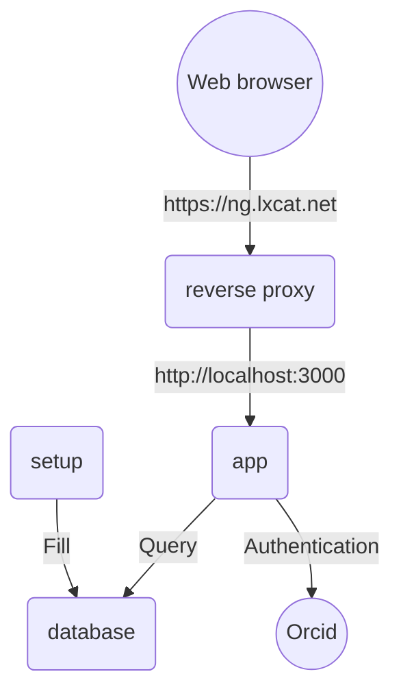

<!--
SPDX-FileCopyrightText: LXCat developer team

SPDX-License-Identifier: AGPL-3.0-or-later
-->

# Maintainer docs

## Table of contents

## Services

The lxcat website consists of several services.



In above graph (written in [Mermaid](https://mermaid-js.github.io/mermaid) format) the boxes are services:

* reverse proxy: Exposes app to Internet. Apache HTTP server is used.
* app: The application. Responsible for rendering HTML pages from database queries and provides API web service endpoints. Uses NextJS as framework.
* database: Database for storing cross sections, users etc. ArangoDB is used.
* setup: Data base utility scripts. Written in Typescript.

Docker compose can run all the services except for the reverse proxy which uses Apache provided by the OS.

## Deployment

The LXCat servers run debian, and the following description is specific to debian 11.
It is considered good practice to run docker in rootless mode.
To that end a special user `docker` is set up, which will run the service using systemd.

### docker
1. The recipe at https://docs.docker.com/engine/security/rootless/ can be followed to set up docker for user `docker`.
2. Provide environment variables by adding the following export in `~/.bashrc`:
```
export DOCKER_HOST=unix:///run/user/$(id -u)/docker.sock
```
3. `docker-compose` is installed by simply installing the binary:
```
$ sudo curl -L https://github.com/docker/compose/releases/download/v2.0.1/docker-compose-linux-x86_64 -o /usr/local/bin/docker-compose
```

### systemd services
Set up systemd services for user `docker` in `$HOME/.config/systemd/user/`:
1. For the docker service add the file `docker.service`:
  ```
  [Unit]
  Description=Docker Application Container Engine (Rootless)
  Documentation=https://docs.docker.com/go/rootless/

  [Service]
  Environment=PATH=/usr/bin:/sbin:/usr/sbin:/usr/local/bin:/usr/bin:/bin:/usr/local/games:/usr/games
  ExecStart=/usr/bin/dockerd-rootless.sh
  ExecReload=/bin/kill -s HUP $MAINPID
  TimeoutSec=0
  RestartSec=2
  Restart=always
  StartLimitBurst=3
  StartLimitInterval=60s
  LimitNOFILE=infinity
  LimitNPROC=infinity
  LimitCORE=infinity
  TasksMax=infinity
  Delegate=yes
  Type=simple
  KillMode=mixed

  [Install]
  WantedBy=default.target
  ```
2. For the `docker-compose` service we use a template, by adding the file `docker-compose@.service`:
  ```
  [Unit]
  Description=docker-compose %i service
  Requires=docker.service network-online.target
  After=docker.service network-online.target

  [Service]
  Environment="DOCKER_HOST=unix:///run/user/%U/docker.sock"
  WorkingDirectory=%h/.config/docker-compose/%i
  Type=simple
  Restart=no

  ExecStartPre=/usr/local/bin/docker-compose pull --ignore-pull-failures
  ExecStartPre=/usr/local/bin/docker-compose build --pull

  ExecStart=/usr/local/bin/docker-compose up --remove-orphans

  ExecStop=/usr/local/bin/docker-compose down --remove-orphans

  ExecReload=/usr/local/bin/docker-compose pull --quiet --ignore-pull-failures
  ExecReload=/usr/local/bin/docker-compose build --pull

  [Install]
  WantedBy=default.target
  ```
3. To fulfill the network dependency add a symlink to the global service:
  ```
  $ ln -s /lib/systemd/system/network-online.target
  ```
4. Enable and start the docker service:
  ```
  $ systemctl --user enable docker.service
  $ systemctl --user start docker.service
  ```
5. Make sure the docker service keeps running when user `docker` logs out:
  ```
  $ sudo loginctl enable-linger docker
  ```

### LXCat NG
LXCat NG comes with a `docker-compose.yml` script which will also be used for the production environment.

1. Since the docker-compose service expects to be working from a directory under `~/.config/docker-compose/` we add a softlink to the location of the local git repository (here `~/git`):
   ```
   $ ln -s $HOME/git/lxcat-ng ~/.config/docker-compose/lxcat-ng
   ```
2. If a suitable environment file `.env` is set up we can start the service:
   ```
   $ systemctl --user enable docker-compose@lxcat-ng.service
   $ systemctl --user start docker-compose@lxcat-ng.service
   ```
3. The docker container port should only be exposed to localhost.
   To provide access from outside a reverse proxy using apache is set up, the relevant part of the apache config being:
   ```
   <VirtualHost>
   ...
   ProxyPreserveHost On
   ProxyPass / http://127.0.0.1:3000/
   ProxyPassReverse / http://127.0.0.1:3000/
   ...
   </VirtualHost>
   ```

Some notes:
- To see the systemd journal use the command:
  ```
  $ journalctl --user-unit docker-compose@lxcat-ng.service
  ```

## Maintenance

* How to check health of website?
